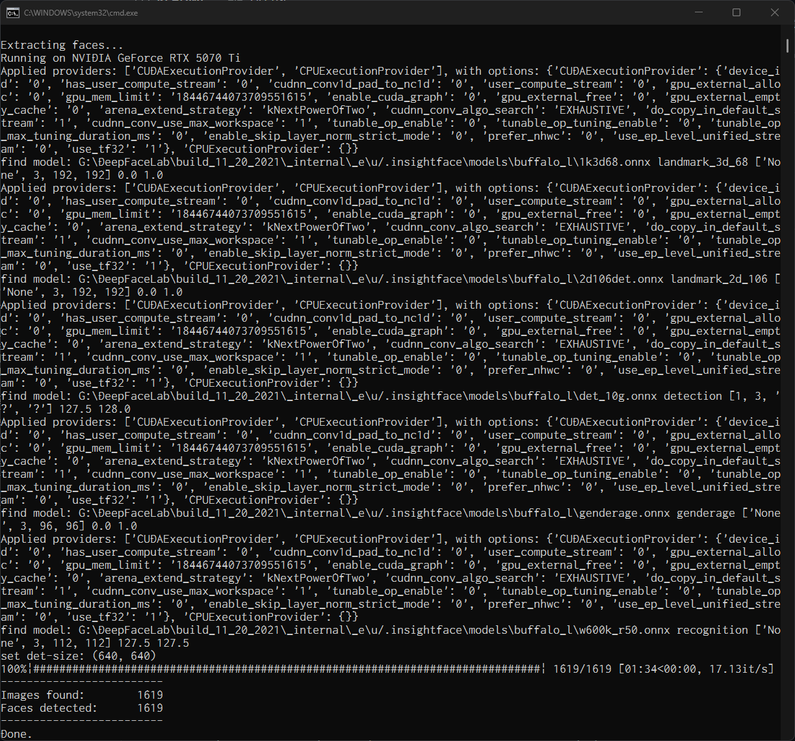

# DeepFaceLab - Optimized version - InsightFace

Integrated [deepinsight/insightface](https://github.com/deepinsight/insightface) into the Extract process, achieving a 4.80x speed increase compared to the traditional S3FD Extractor.

---

# Installation

- Copy the files from this repository inside `_internal\DeepFaceLab`, replacing the existing files.
- The Python 3.6.8 bundled with DeepFaceLab does not work, so you need to install Python 3.10.x separately.
  - [Python Release Python 3.10.11 | Python.org](https://www.python.org/downloads/release/python-31011/)
- Next, create a virtual environment with Python 3.10.x and install the required packages there.
- ```bat
  cd _internal
  py -3.10 -m venv python-3.10-venv
  python-3.10-venv\Scripts\activate.bat
  python -m pip install pip --upgrade
  pip install -r DeepFaceLab\requirements-cuda.txt
  ```
- Edit the Python environment variables in `_internal\setenv.bat`.
- ```bat
  SET PYTHON_PATH=%INTERNAL%\python-3.10-venv
  SET PYTHONEXECUTABLE=%PYTHON_PATH%\Scripts\python.exe
  SET PYTHONWEXECUTABLE=%PYTHON_PATH%\Scripts\pythonw.exe
  ```
- You're amazing! 🎉

---

## Performance changes 🚀


### Extraction (step 4 and 5)
Estimated speedup: **4.80x** 😊


Measured on:
- 1619 pictures (HD 1280x720)
- detector s3fd
- image-size 512
- jpeg-quality 90
- output-debug
